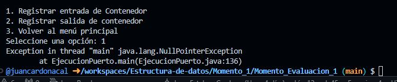

En el proceso de elaboracion del proyecto se buscó implementar ayuda de la IA, sin embargo presentó faltas de razonamiento respecto al procesamiento de las solicitudes de registro de buques, teniendo en cuenta que en lo que a mi respecta, la aplicación debería tener submenús que ese encarguen de:

- permitir que mas contenedores puedan ser ingresados de forma inmediata, esto con el fin de agilizar el proceso de registro de los contenedores.
  
- administrar el espacio de los buques como estructuras existentes que de manera más realista interactuan con los contenedores y que no solo son estructuras que llegan a ocupar un espacio en el puerto.

8/03/2026 3:00am

Las cosas se complican un poco, mañana tengo un compromiso y dejo este problema pendiente.

8/03/2026 6:30pm

Nuevamente nos reubicamos con la elaboración del proyecto, entendiendo que el problema que presenta no es muy dificil de resolver.

Despues de tener que luchar contra el codigo para que corriera, se logro que la logica del generador integrado dentro de la clase gestion de puerto pudiera acoplarse al main de ejecucion; Ahora, lo que sigue es realizar los respectivos submenús de registro de buques y contenedores.

Ha estado un poco demorado debido a que hubo que tratar de que el codigo que se encontraba funcional aun conservara la capacidad de funcionar sin fallos o errores pese a la modificacion del mismo, aun así, se logró elaborar el submenú de registro de buques con una funcion agregada propia en adicion a la descripcion de la guia, esto motivado por el hecho de que se podía hacer un modelado mas realista aun si se sacrificaba tiempo en la elaboracion total de la aplicacion (complemento a las competencias del ser y el hacer)

