Este será el espacio a utilizar como constancia del cumplimiento
de cada punto especificado en el taller tanto la informacion explicita
como las insinuaciones implicitas dentro del taller.

Comenzamos:

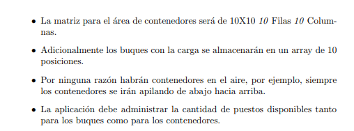
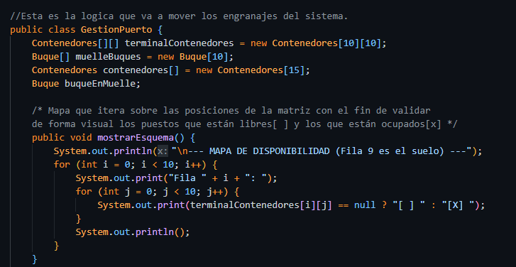
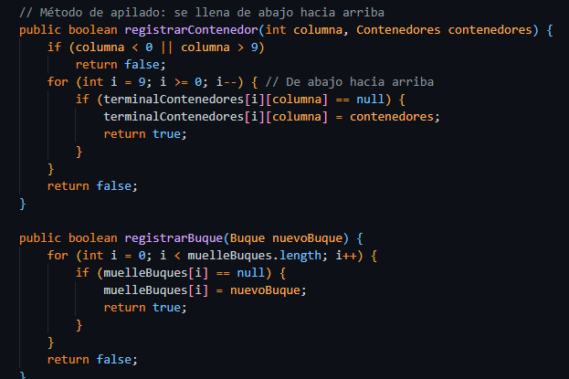

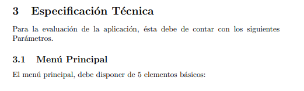
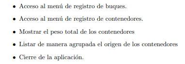
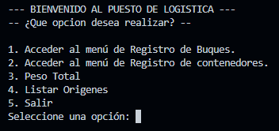

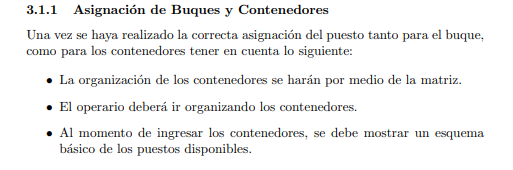
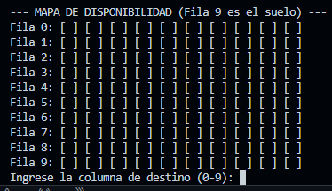
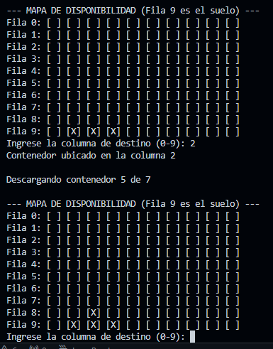

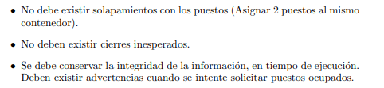
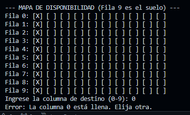

